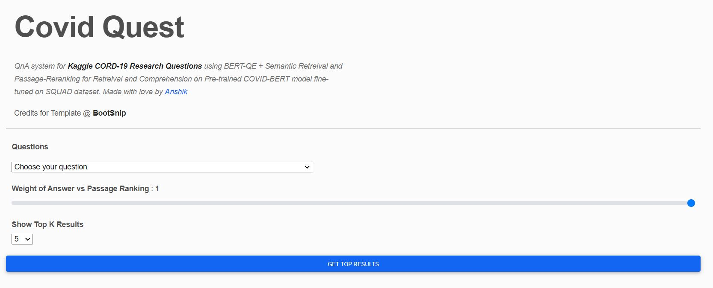

# Covid-Quest
QnA system for Kaggle CORD-19 Research Questions using BERT-QE + Semantic Retreival and Passage-Reranking for Retreival and Comprehension on Pre-trained COVID-BERT model fine-tuned on SQUAD dataset.

This is the code for Flask App for the QnA app.

